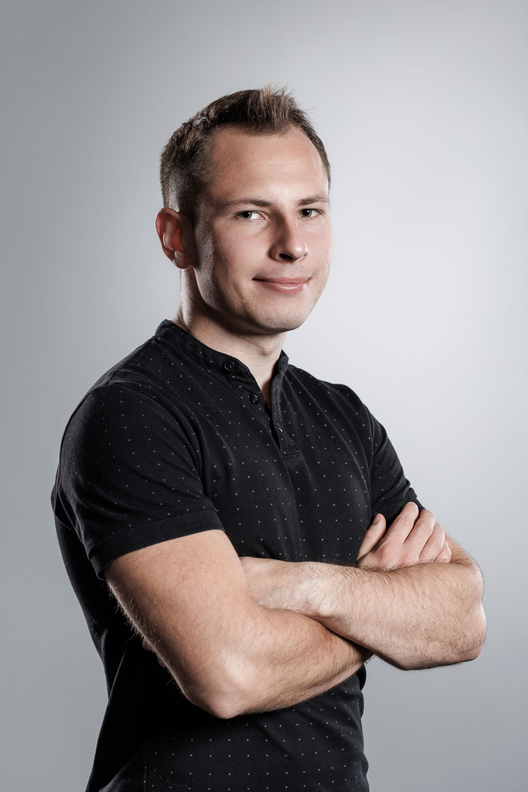

# About

<!--author-->

<!-- {: width="250" height="80"} -->

<!-- 

 -->

I am a PhD student at Harvard in many-body quantum physics. I am fortunate to be advised by [Professor Norman Yao](https://www.physics.harvard.edu/people/norman-y-yao). I am a member of the inaugural cohort of the Quantum Science and Engineering program, part of the [Harvard Quantum Initiative](https://quantum.harvard.edu/). I am broadly interested in theoretical out-of-equilibrium many-body physics, topological phases and aspects of AI in many-body physics.

Not doing physics I mostly spend my time exercising, running, cycling or playing banjo.

In the past, I have studied in the capital of England at UCL and at the [London Centre for Nanotechnology](https://www.london-nano.com/). I graduated with master's degrees in Physics and Quantum Technologies. I hail from [Lublin, Poland](https://en.wikipedia.org/wiki/Lublin).

> **Contact:** dkufel [at] g.harvard.edu
{:.lead}
